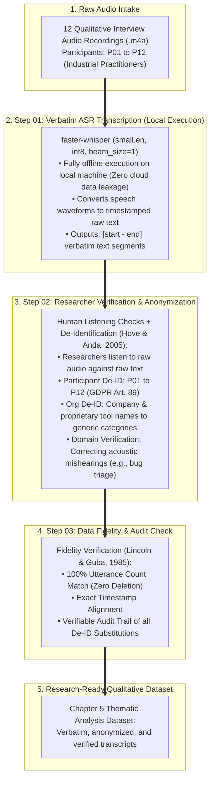
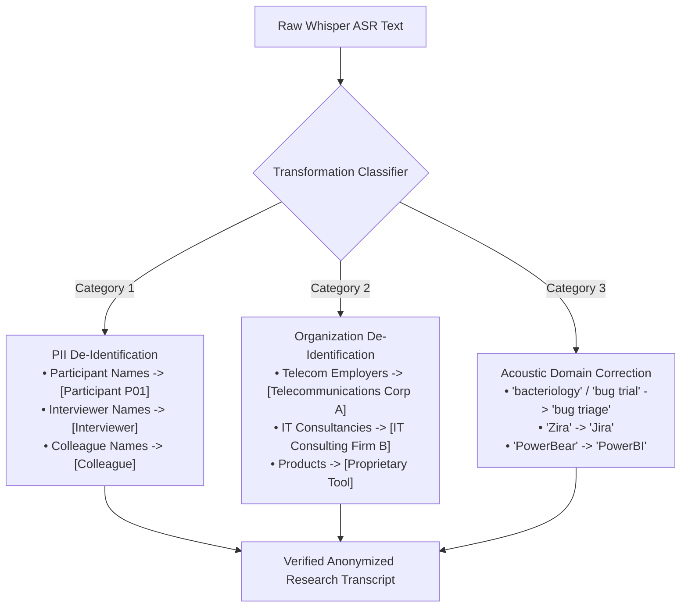

# Transcription & Anonymization Pipeline Knowledge Map
## PA2534 Master's Thesis: Decision-Making Under Uncertainty in Bug Triage and Defect Prioritisation
**Authors:** Naga Sai Abhiram Gopal Vemana & Vineeth Kumar Vajja  
**Supervisor:** Muhammad Laiq  
**Institution:** Blekinge Institute of Technology (BTH), Karlskrona, Sweden  
**Date:** May 2026  

---

### Purpose of this Knowledge Map

This document serves as the **Data Processing Specification**, **Trustworthiness Blueprint**, and **Oral Defense Guide** for the qualitative interview dataset ($P01 to P12$). It systematically documents the procedure used by the authors to convert raw interview audio recordings into verbatim, de-identified research transcripts, grounded in established qualitative empirical standards in software engineering (Lincoln & Guba, 1985; Hove & Anda, 2005; Runeson & Höst, 2009; Bryman, 2016).

---

## 1. Methodological Design & Technical Rationale

The data processing pipeline was designed around three clear, straightforward principles: data confidentiality, efficient local execution, and rigorous manual verification.

1. **Data Privacy & GDPR Custody (Zero External Cloud Leakage):**
   * **The Requirement:** The interview recordings contain sensitive discussions with practitioners, including real developer names, colleague references, proprietary software tool names, and commercial employer identities.
   * **Why Cloud Services Were Avoided:** Transmitting raw audio files to commercial third-party cloud services or SaaS APIs would mean un-anonymized industrial data is processed on external servers. To guarantee strict compliance with the European General Data Protection Regulation (GDPR Article 89) and BTH research ethics standards, all audio files were processed strictly offline on encrypted local machines. The raw audio recordings never left the researchers' custody.

2. **Why Faster-Whisper? (Efficiency & Deterministic Processing):**
   * **Open-Source Baseline:** Whisper (Radford et al., 2023) is a recognized, state-of-the-art open-source speech recognition model.
   * **Optimized Local Execution:** `faster-whisper` uses the `CTranslate2` inference engine, running up to 4x faster with lower memory usage via 8-bit quantization (`int8`). This enabled fast, reliable, and completely offline transcription without external service dependencies.
   * **Deterministic Greedy Decoding:** By setting `beam_size=1` and `temperature=0.0`, the model performs deterministic greedy decoding, producing consistent initial raw transcripts.

3. **Empirical Quality Assurance: Manual Listening Checks:**
   * In empirical software engineering research (Hove & Anda, 2005; Runeson & Höst, 2009; Seaman, 1999), an automated transcription model only provides an initial draft.
   * Running a software model repeatedly cannot correct domain-specific phonetic misunderstandings.
   * **Academic Ground Truth:** The true validity of the transcripts was established through **the researchers conducting manual listening checks against the raw audio recordings** (Hove & Anda, 2005). The authors personally listened to every recording, correcting technical acoustic mishearings (such as *bug triage* or tool names like *Jira*) while keeping the participant's exact spoken words, phrasing, and explanations 100% verbatim.

---

## 2. Pipeline Execution Specifications & File Roles

| Pipeline Stage | Script File | Core Technology & Method | Methodological Purpose | Empirical Research Standard |
| :--- | :--- | :--- | :--- | :--- |
| **Master Entrypoint** | `run_entire_pipeline.py` | Python CLI Subprocess Controller | Executes Steps 01 $\to$ 02 $\to$ 03 sequentially with verification. | **Reproducibility:** Transparent, scripted data preparation. |
| **Step 01: Transcription** | `01_transcribe_audio_to_raw.py` | `faster-whisper` (`small.en`, `int8`, `beam_size=1`) | Converts `.m4a` audio recordings into timestamped raw utterance text files (`Transcripts/raw/PXX_raw.txt`). | **Dependability & Privacy:** Local execution protecting raw audio custody; verbatim baseline with exact timestamps. |
| **Step 02: Verification & Anonymization** | `02_format_and_anonymize_transcripts.py` | Human Listening Checks + Deterministic De-ID Mapping | De-identifies participant names, organizations, and corrects acoustic mishearings of domain terms without altering participant phrasing. | **Hove & Anda (2005) / GDPR Article 89:** Human verification of transcripts and ethical identity shielding. |
| **Step 03: Fidelity Audit** | `03_verify_transcript_fidelity.py` | Line-by-Line Segment Parser & Diff Analyzer | Compares raw text vs. anonymized Markdown, verifying 100% utterance count match and logging all substitutions. | **Lincoln & Guba (1985):** Confirmability audit trail proving zero data deletion or cherry-picking. |

---

## 3. Transformation Taxonomy & Substitution Rules (Step 02)

Every modification between the raw ASR text and the final research transcript falls strictly into one of three permissible categories:

* **Zero Content Deletion Rule:** No participant statements, technical arguments, hesitations, or contextual details are deleted or summarized.
* **Exact Timestamp Preservation:** Start and end timestamps (`[start - end]`) are preserved across every single utterance to maintain direct traceability back to the audio waveforms.

---

## 4. Chapter 3 Methodology Text: Data Processing & Verification

This text is structured for direct inclusion in **Chapter 3 (Methodology - Interview Data Preparation & Trustworthiness)**:

> **Audio Transcription and Verification:**  
> Semi-structured interview audio recordings were transcribed using an open-source automated speech recognition model (Faster-Whisper `small.en`) executed locally on secure, encrypted machines. Local offline execution was chosen to ensure participant data confidentiality and comply with European General Data Protection Regulation (GDPR Article 89) and BTH research ethics guidelines, ensuring raw audio containing commercial company names and developer identities was never uploaded to external cloud services.
>
> Following initial transcription, the researchers conducted manual listening checks against the original audio recordings to verify transcription accuracy and identify domain-specific acoustic errors, following empirical software engineering guidelines (Hove & Anda, 2005; Runeson & Höst, 2009). Technical terminology that was phonetically misheard by the model (such as *bug triage* or tool names like *Jira*) was corrected while preserving the participant's exact phrasing, vocabulary, and technical reasoning verbatim.
>
> **Anonymization and Ethical Compliance:**  
> In compliance with GDPR (Article 89) and BTH ethical research guidelines, all participant names, colleague identities, company names, and proprietary system identifiers were replaced with standardized anonymous placeholders (e.g., $[Participant\ P01]$, $[Telecommunications\ Corp\ A]$).
>
> **Transcript Fidelity and Confirmability Audit:**  
> To ensure research confirmability and prevent subjective distortion (Lincoln & Guba, 1985), an automated verification check was conducted comparing the raw ASR output against the final anonymized transcripts. This verified 100% utterance count parity and exact timestamp alignment across the entire 12-participant dataset, confirming that zero participant content was omitted, summarized, or altered during post-processing.

---

## 5. Oral Defense Q&A: Clear & Grounded Author Responses

| Anticipated Examiner Question | Clear & Defendable Author Response | Supporting Literature |
| :--- | :--- | :--- |
| **"Why did you use Faster-Whisper instead of a commercial cloud service like Otter.ai or Google Cloud?"** | "Data privacy was our primary consideration. Commercial cloud services require transmitting raw audio to external third-party servers, which introduces confidentiality risks for the companies and practitioners involved. By running Faster-Whisper locally on our own machines, the raw audio never left our custody, adhering to GDPR Article 89 and BTH ethical guidelines. Faster-Whisper is an efficient, open-source implementation of Whisper (Radford et al., 2023) that provided an accurate, reproducible, and fully offline workflow." | Radford et al. (2023); Bryman (2016); GDPR Art. 89 |
| **"How did you verify the accuracy of the automated speech recognition model?"** | "Automated speech recognition provided our initial draft transcripts, but automated outputs require validation. In accordance with empirical software engineering guidelines (**Hove & Anda, 2005**; **Runeson & Höst, 2009**), we conducted manual listening checks by listening to the audio recordings while reviewing the text. This allowed us to catch domain-specific acoustic errors-such as when the model misheard *bug triage* or tool names like *Jira*-and correct them while keeping all participant responses verbatim." | Hove & Anda (2005); Runeson & Höst (2009) |
| **"Why did you run the transcription pipeline once rather than multiple times?"** | "In qualitative research, validity does not come from repeatedly running an automated model. Running a deterministic model with fixed parameters on the same audio produces identical text output, but cannot resolve domain mishearings. In line with empirical SE guidelines, validity comes from **the researchers listening to the actual audio recordings and verifying the text against the participant's spoken voice** (**Hove & Anda, 2005**; **Lincoln & Guba, 1985**)." | Hove & Anda (2005); Lincoln & Guba (1985) |
| **"How do you prove that anonymization did not alter or bias the data?"** | "We implemented an automated audit script (`03_verify_transcript_fidelity.py`) that performed a line-by-line comparison between the raw ASR output and the final anonymized files. The script confirmed 100% utterance segment match and exact timestamp alignment across all 12 transcripts, proving that no participant statements or contextual nuances were deleted or summarized (**Lincoln & Guba, 1985**)." | Lincoln & Guba (1985); Braun & Clarke (2006) |
| **"How did you protect participant confidentiality and organizational identities?"** | "We followed GDPR Article 89 and BTH research ethics standards by assigning all participants alphanumeric codes ($P01 to P12$) and replacing all organizational and proprietary tool names with standardized generic descriptions (e.g., $[Telecommunications\ Corp\ A]$). No identifying metadata exists in the research dataset." | Bryman (2016); Runeson & Höst (2009) |
